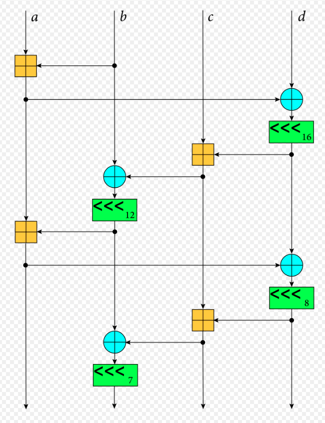
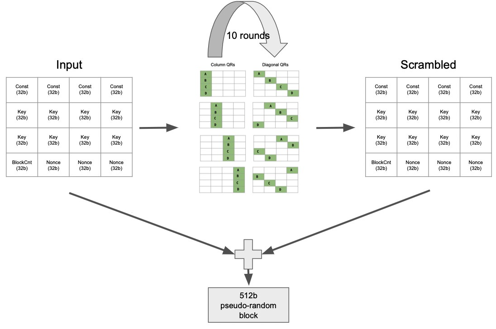

Homework 3 - Parameterized Generators
=======================

# Problem 1 - Conway's Game of Life (50pts)
[Conway's Game of Life](https://en.wikipedia.org/wiki/Conway's_Game_of_Life) models cellular automata on a 2D _grid_. Each square in the grid is occupied by a cell that is either alive or dead. Based on how many neighbors of a cell are alive, the cell will either survive or die due to overpopulation. An empty/dead cell with a sufficient number of living neighbors can even spawn a new live cell. Given an initial state of the grid, the game proceeds deterministically. In each round the game applies the evolution rules to the determine the next state of the grid. Many interesting behaviors arise when certain starting conditions are met or the rules are tweaked.

For our treatment of the game, we will assume the grid has a fixed predetermined size, and we will treat each grid cell as a Boolean quantity (true if alive). Each cell will consider all 8 of its immediate neighbors (includes diagonals). If a cell is on the edge of the grid, its missing neighbors (because they are off the edge of the grid) will be counted always as not alive. We will use the classic rules by default, but your implementations should be parameterized for the thresholds used in the rules:

+ A living cell "survives" (stays alive) if at least `minToSurvive` neighbors and no more than `maxToSurvive` neighbors are alive. If a greater or fewer number of neighbors are alive, the cell dies.
+ A dead cell stays dead unless exactly `neighsToSpawn` neighbors are alive.

In this assignment, you will implement a Chisel generator `GameOfLife` to run the game. We have provided much of the harnessing infrastructure to ease getting started, loading in initial game states, and testing.


### Part 1 - Scala Model (`GameOfLifeSim`)

First you will implement a Scala model of the game (`GameOfLifeSim`) which will not only help with learning the game, but it will also help us test the Chisel generator later on. Familiarize yourself with `GameOfLifeSim.scala` which is inside the test source directory. We have broken the problem into a class for the grid (`Grid`) and a class to run the game (`GameOfLifeSim`). A Grid contains all of the cells for a given round of the game, and the next round will produce a new Grid.

There are a few usages of Scala we wanted to point out. The `cells` are represented by a 2D array of `Boolean` using an `ArrayBuffer`. An ArrayBuffer is a `mutable` collection in Scala. We intend for you to write each cell only once (new rounds will generate a new Grid instance), but making them mutable allows you to fill them in a manner/order you find most convenient. Since we declared it as 2D, you can access row _i_ and column _j_ with `cells(i)(j)`. We use a `var` to hold the current grid within GameOfLifeSim, and as you can see in the provided code for `evolve()`, it is overwitten for a new round.

To complete the Scala model, you will need to implement the `nextGrid` method within `GameOfLife`. We recommend breaking the problem into helper methods, and you might choose to place some of them inside of `Grid`. The first testcase in `GameOfListTester` executes only `GameOfLifeSim` (no Chisel) and compares its final output to a saved string.


### Part 2 - Chisel Generator (`GameOfLife`)

With a reliable `GameOfLifeSim`, you are now ready to implement your Chisel generator `GameOfLife`. The Chisel generator will take parameters for the grid dimensions as well as the game rules. With that, your generator will produce a full grid of single-bit registers that have their next-state values set appropriately to gridexecute the game.

The basic operation of the generated module is well captured by its I/O:
* `load` - when true, load in the entire grid all at once from `gridIn`
* `step` - when true, advance the game by one round
* `gridIn` - the entire grid to be loaded in
* `gridOut` - the current state of the entire grid

To capture the needed flexibility, both `gridIn` and `gridOut` use 2D `Vec`s. They are addressable just like other 2D collections in Scala. Note, the actual cells are registers, but they are declared inside a immutable `Seq` `cells` since you should not reassign that collection. You will be changing the connections to the cells.

The testing infrastructure should be able to use your `GameOfLifeSim` to test your `GameOfLife` implementation. When implementing your generator, we strongly recommend you consider what abstractions or helper methods you could use to make your life easier. When making these helper methods, be sure to mind which values are Chisel or Scala.


### Tips

* Both implementations should use a 2D grid of boolean values (dense representation) for the cells, and we have provided the code for declaring them.
* The thresholds for the game are in a case class `GameRules` defined in `GameOfLife.scala`
* If you find yourself writing 8 nearly identical copies of code (one per neighbor), reconsider. Do spend a moment to think about what abstractions could help break this problem down.
* A handy method available on Scala collections is `.sum` which will total up all of the values contained within.
* In Chisel, a similar handy method `PopCount` counts the number of high bits in a `UInt`
* You will probably want to make more tests or at least better understand the ones provided. Inside `LifeTestData` (inside `GameOfLifeTester.scala`) we provide some sample inputs and outputs. We also provide the code to load that particular string format into a grid. When developing, you may also want to use the `testOnly` feature to execute a single test.


# Problem 2 - ChaCha20 Block Function (50pts)
Last homework we built an `XORCipher` that allowed us to encrypt our memory by XORing a secret key and our message. For this assigment we will focus on the key generation process by implementing the stream cipher [ChaCha20](https://en.wikipedia.org/wiki/Salsa20#ChaCha_variant). 

### Motivation
> * There is plenty of hardware support for the more popular AES cipher but less for ChaCha. We have the opportunity to practice Chisel while contributing something new!
> * For the security of our `XORCipher` we require as many unique secret keys as messages which is cumbersome to communicate. A stream cipher generates a keystream (i.e MBs) from a lightweight seed (i.e 256b), greately reducing storage and communication requirements.

### ChaCha20 [Specs](https://tools.ietf.org/html/draft-irtf-cfrg-chacha20-poly1305-01#section-2.1)
At a high level, we apply many rounds of 32b additions, XORs, and bit shifts to scramble our secret key, producing a 512b block of random bits. The contiguous stream of blocks is called the keystream. Given a keystream it is intractable to recover the original secret key even though the scrambling function is known. Since these operations are deterministic, knowledge of the secret key allows one to reproduce the keystream (i.e to decrypt).

We start with 512 bits which can be split into 16 x 32b `UInt`s called a `block`.  For visualization we can arrange this in a 4x4 matrix. The algorithm will operate on 4 of the 16 cells at a time. The block is composed of four pieces: 
> * key = 256b - the secret input to generate the keystream.
> * nonce = 96b - "number only used once" per key and per block (for the curious [here](https://en.wikipedia.org/wiki/Initialization_vector)).
> * blockCnt = 32b - The index of the current block, by convention tied to a 32b counter. This means for a given key there will be $2^{32}$ possible blocks in our keystream. Since the `blockCnt` is incrementing we can use it index which block we are on. This let's you quickly compute a block at any point in the keystream without needing to compute previous blocks, which is not true for all stream ciphers.
> * const = 128b - These bits are embedded directly into the starting block, and were chosen by the cipher designer to provide initial entropy.


Note that we will be using the most recent ChaCha20 specs where the `BlockCnt` is 32b instead of 64b and the `nonce` is 96b instead of 32b (which is what Wiki shows). 

### Operations
We scramble our block by iteratively applying a _quarter round_ function. `QR(a, b, c, d)` takes four 32b `UInt`s and performs the following operations:
> ```
>  a += b; d ^= a; d <<<= 16;
>  c += d; b ^= c; b <<<= 12;
>  a += b; d ^= a; d <<<= 8;
>  c += d; b ^= c; b <<<= 7;
> ```
Note the `<<<=` notation means _rotate left_, which is a left bit-shift where any overflow bits are shifted into the LSBs. (i.e `0b1100 <<< 1 = 0b1001`). The `ROTL` function is provided in the `ChaChaModel` object as a guide. Visually this is what is happening (src [wiki](https://en.wikipedia.org/wiki/Salsa20#/media/File:ChaCha_Cipher_Quarter_Round_Function.svg)): 
> 

To generate a block, we will apply `QR` a total of `80` times (10 rounds of 4 column and 4 diagonal QRs) and then add the result with our original block. For each round, we instantiate `QR(a,b,c,d)` 4 times (in one cycle), with the difference being which data is used for `a,b,c,d`. The highlighted squares in the figure below show which data is used when. The complete ChaCha keystream generation process is shown here:

> 

### What is provided
- `src/main/scala/hw3/ChaCha.Scala`
    * `ChaChaModel` - contains a fully implemented ChaCha Scala model.
    * `ChaChaIn` - useful interface for testing.
    * `ChaCha` - the companion object for our unimplemented `ChaCha` chisel module. This object contains some helper methods as well as unimplemented `ROTL` and `QR` methods.
    * `Packet` - A helper bundle that will be part of our module's input.
    * `ChaChaIO` - The interface to our module.
- `src/main/scala/hw3/ChaChaTestSuite.Scala`
    * `ChaChaModelBehavior` - The test suite for the Scala model. 
    * `ChaChaModelTester` - The scalatest wrapper for the Scala model.
    * `ChaChaBehavior` - The test suite for the Chisel model. If your code passes these tests you can feel confident your ChaCha implementation is correct.
    * `ChaChaTester` - The scalatest wrapper for the Chisel model.

### Deliverables
* Implement `ChaCha.ROTL`, `ChaCha.QR`, and the `ChaCha` module using the provided Scala model and tests as a guide.
* The `ChaCha` module will have the following behavior (as demonstrated in the provided tester):
    * The module will hold on to the last valid input received. If a new valid input is received, the module will reset and hold onto that. When the input's valid signal goes low, the rounds will begin.
    * We have data-level parallism when performing the column rounds or the diagonal rounds. We will exploit this parallelism and complete either all four column or all four diagonal rounds each cycle for a total of `20` cycles: 
    >  ```
    >  // Cycle 0
    >  QR(0, 4,  8, 12)	// 1st column
    >  QR(1, 5,  9, 13)	// 2nd column
    >  QR(2, 6, 10, 14)	// 3rd column
    >  QR(3, 7, 11, 15)	// 4th column
    >  // Cycle 1
    >  QR(0, 5, 10, 15)	// diagonal 1 (main diagonal)
    >  QR(1, 6, 11, 12)	// diagonal 2
    >  QR(2, 7,  8, 13)	// diagonal 3
    >  QR(3, 4,  9, 14)	// diagonal 4
    >  ```

### Tips
* Ensure your `ROTL` is correct before considering testing `QR`.
* You must save a copy to your original inputs to add with the final output of the round functions.
* All arithmetic is 32b, so make sure you're wrapping/truncating appropriately.
* A fun [Computerphile video](https://www.youtube.com/watch?v=UeIpq-C-GSA) explaining ChaCha.

