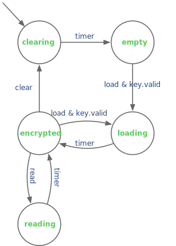

Homework 3 - Parameterized Generators
=======================
# Problem 1 - XOR Cipher Upgraded (50pts)
We will take our `XORCipher` from the [last homework](https://github.com/agile-hw/hw2), and significantly upgrade it:
* Increase storage - instead of holding only a single word of data and reading/writing it entirely in one cycle, we will use a memory to hold a configurable amount of data. We will stream data in or out over multiple cycles (one word / cycle).
* Stored data is always encrypted - Unlike the prior version, data stored will always be encrypted. It can only be decrypted when being read, but the decrypted version is not stored.
* No more key storage - The "user" of this module must provide the key as input when they are storing (and encrypting) or reading (and decrypting).
* _Additional Chisel Concepts_ - In the prior version, we practiced instantiating registers and a FSM. In this version, we will also practice using a memory, a counter (_hint_), and a `Valid` interface.
After making the improvements above and refactoring, the interfaces and states are significantly changed.

The `XORChipher` will be parameterized to have `numWords` words of storage of width `width`. When it is first turned on, the `XORCipher` will zero out all of its memory. When the user gives the `load` command, it will send the input data with the key over `numWords` cycles. To read the data decrypted, the user will give the `read` command with the key. It will output the data decrypted over the next `numWords` cycles. The user can also give the `clear` command to zero out the memory.

The `XORCipher` module will take advantage of _Valid_ interface ports to indicate the presence of useful signals. The input port for the `key` will be _Valid_, so the module will be able to recognize when it is being provided a key. If the key is not sent with `valid=true`, then it will not go into the loading state because it needs the key to encrypt the data. However, the reading state can be done with and without a valid key. If given a valid key, the output should be decrypted. If not given a valid key, the output should be the encrypted contents. The data output for the module will also take advantage of valid signaling. When not in the reading state, the output should be marked invalid, and to be safe, also zeroed out. The output should only be valid when reading.

The memory should be implemented with the `Mem` construct, which technically with most CAD flows may turn out to be registers. With this type of memory, reads are combinational (0 cycle delay), while writes are sequential (1 cycle delay). Because the memory is fast, transfers start immediately. For example, in the same cycle `load` is set to 1, the first data word should also be sent in on the input `in`.

You can make a few assumptions. First, the user will not change the command or the key mid-operation. Second, they will assert at most one command wire at a time. Below we have provided a high-level view of the control FSM. Please complete `XORCipher` in `src/main/scala/hw3/XORCipher.scala`

# Problem 2 - Conway's Game of Life (50pts)
[Conway's Game of Life](https://en.wikipedia.org/wiki/Conway's_Game_of_Life) models cellular automata on a 2D _grid_. Each square in the grid is occupied by a cell that is either alive or dead. Based on how many neighbors of a cell are alive, the cell will either survive or die due to overpopulation. An empty/dead cell with a sufficient number of living neighbors can even spawn a new live cell. Given an initial state of the grid and evolution rules, the game proceeds deterministically. In each round the game applies the evolution rules to the determine the state of the grid for the next cycle. Many interesting behaviors arise with certain starting conditions or when the rules are tweaked.

For our treatment of the game, we assume the grid size is both constant and predetermined. We treat each grid cell as a Boolean quantity (true if alive). Each cell will consider all 8 of its immediate neighbors (including diagonals). If a cell is on the edge of the grid, its missing neighbors (because they are off the edge of the grid) will be always counted as not alive. We will use the classic rules by default, but your implementations should be parameterized by the evolution rules:

+ A living cell "survives" (stays alive) if at least `minToSurvive` neighbors and no more than `maxToSurvive` neighbors are alive. If a greater or fewer number of neighbors are alive, the cell dies.
+ A dead cell stays dead unless exactly `neighsToSpawn` neighbors are alive.

In this assignment, you will implement a Chisel generator `GameOfLife` to run the game. We have provided much of the infrastructure to ease getting started, loading in initial game states, and testing.

### Part 1 - Scala Model (`GameOfLifeSim`)

To get started, you will implement a Scala model of the game (`GameOfLifeSim`) which will not only help with learning the game, but it will also help us test the Chisel generator later on. Familiarize yourself with `GameOfLifeSim.scala` which is inside the test source directory. We have broken the problem into a class for the grid (`Grid`) and a class to run the game (`GameOfLifeSim`). A Grid contains all of the cells for a given round of the game, and the next round will produce a _new_ Grid.

There are a few Scala details we want to point out. The `cells` are represented by a 2D array of `Boolean` using an `ArrayBuffer`. An ArrayBuffer is a `mutable` collection in Scala. We intend for you to write each cell only once (new rounds will generate a new Grid instance), but making them mutable allows you to fill them in a manner/order you find most convenient. Since we declared it as 2D, you can access row _i_ and column _j_ with `cells(i)(j)`. We use a `var` to hold the current grid within GameOfLifeSim so it can be overwritten for each round (in provided code for `evolve()`).

To complete the Scala model, you will need to implement the `nextGrid` method within `GameOfLifeSim`. We recommend breaking the problem into helper methods, and you might choose to place some of them inside of `Grid`. The first testcase in `GameOfListTester` executes only `GameOfLifeSim` (no Chisel) and compares its final output to a saved string.

### Part 2 - Chisel Generator (`GameOfLife`)

With a reliable `GameOfLifeSim`, you are now ready to implement your Chisel generator `GameOfLife`. The Chisel generator will take parameters for the grid dimensions as well as the game rules. With that, your generator will produce a full grid of single-bit registers that have their next-state values set appropriately to execute the game.

The basic operation of the generated module is well captured by its I/O:
* `load` - when true, load in the entire grid all at once from `gridIn`
* `step` - when true, advance the game by one round
* `gridIn` - the entire grid to be loaded in
* `gridOut` - the current state of the running grid

To capture the needed flexibility, the ports `gridIn` and `gridOut` use 2D `Vec`s. They are addressable just like other 2D collections in Scala. Internally, the actual cells are registers, but they are declared inside a immutable 2D `Seq` `cells` since you should not reassign that collection or dynamically address them. Any connections you intend to make should be done at ellaboration time.

The testing infrastructure should be able to use your `GameOfLifeSim` to test your `GameOfLife` implementation. When implementing your generator, we strongly recommend you consider what abstractions or helper methods you could use to make your life easier. When making these helper methods, be sure to mind which values are Chisel or Scala.

### Tips

* Both implementations should use a 2D grid of boolean values (dense representation) for the cells, and we have provided the code for declaring them.
* The thresholds for the game are in a case class `GameRules` defined in `GameOfLife.scala`
* If you find yourself writing 8 nearly identical copies of code (one per neighbor), reconsider. Do spend a moment to think about what abstractions could help break this problem down.
* A handy method available on Scala collections is `.sum` which will total up all of the values contained within.
* In Chisel, a similar handy method `PopCount` counts the number of high bits in a `UInt`
* You will probably want to make more tests or at least better understand the ones provided. Inside `LifeTestData` (inside `GameOfLifeTester.scala`), we provide some sample inputs and outputs. We also provide the code to load that particular string format into a grid. When developing, you may also want to use the `testOnly` (in sbt) feature to execute a single test. In IntelliJ, you can right click on the green triangle next to a test case to run only that case.
